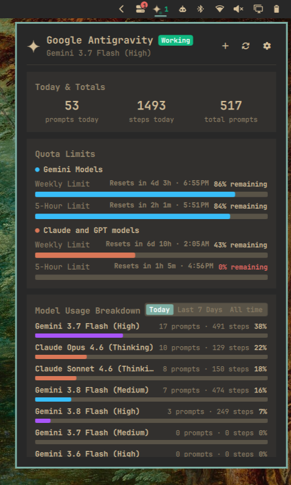

# Antigravity Tokens & Usage for Omarchy

Real-time Antigravity agent monitor, live token quota meters, interactive session launcher, model breakdown, and tool telemetry for the [Omarchy](https://omarchy.org/) status bar.



---

## Features

### 1. Status Bar Icon, Live State Pulse & Dynamic Badges
- **Themed Sparkle Icon**: Clean vector sparkle icon dynamically colorized to match your active Omarchy theme foreground color (`MultiEffect`).
- **Real-Time State Pulse Indicator**: Color-coded pulse dot indicating live agent status:
  - 🟢 **Pulsing Green (`Working`)**: An agent is actively executing commands, analyzing files, or generating tokens.
  - 🔵 **Solid Blue (`Waiting`)**: An interactive terminal session is open and waiting for user input.
  - ⚪ **Transparent (`Idle`)**: No active sessions.
- **Configurable Bar Badge Modes**:
  - `percent` (Default): Shows live remaining token/quota percentage (e.g. `95%`), turning amber below 30% and urgent below 15%.
  - `active`: Count of concurrent active sessions currently running.
  - `prompts`: Total prompts executed today.
  - `off`: Minimal icon only.
- **Rich Hover Tooltip**: Displays active session count, Google account email, token pool readout, today's prompts, and active model.

### 2. Interactive Session Management
- **One-Click Terminal Resume**: Click any recent session card or press `1`–`5` to instantly resume that conversation in your terminal (`agy --conversation <id>`).
- **Terminal Emulator Handoff**: Works seamlessly with `xdg-terminal-exec`, `ghostty`, `kitty`, `foot`, and `alacritty` with automatic working directory (`--dir`) handoff.
- **New Session Launcher**: Press `n` or click `` in the header to launch a brand-new `agy` terminal session.
- **Session Termination**: Hover over any running session and click `` to terminate the process cleanly (`SIGTERM`) and release its presence lock.

### 3. Dual Quota Windows & Token Pool
- **Real-Time Quota Buckets**: Powered directly by `agy -p /usage --output-format json` (no tokens or scraping required).
- **Dual Time Windows**: Shows both **5-Hour burst limits** and **Weekly rolling limits** for Gemini and Claude/GPT models.
- **Dual Reset Times**: Displays both relative countdowns (e.g. `4h 17m`) and local wall-clock times (e.g. `10:09 AM`).
- **Exact Token Pool Readout**: Displays formatted token limits (e.g. `991k / 1.05M tokens`).
- **Desktop Alerts**: Configurable desktop notifications (`omarchy-notification-send`) when quota falls below threshold (5%–50%, default 15%).

### 4. Model Analytics & Telemetry
- **Model Usage Breakdown**: Timeframe toggle (**Today**, **Last 7 Days**, **All time**) with animated proportional progress bars.
- **7-Day Activity Sparkline**: Daily prompt activity chart across the past week.
- **Tool Telemetry Counters**: Live call counters for tools (`run_command`, `view_file`, `write_to_file`, `grep_search`, `subagents`, etc.).

### 5. Native Omarchy Integration
- **Layer-Shell `KeyboardPanel`**: Smooth positioning anchored directly to the bar icon, supporting compositor window rules and keyboard focus.
- **In-Popup Settings View**: Right-click or press `s` to tweak polling intervals, badge modes, alerts, and terminal overrides.
- **Compositor IPC**: Registers `mrworld.antigravity-tokens` for Hyprland/Sway keybindings (`omarchy-shell shell toggle mrworld.antigravity-tokens`).
- **Omarchy Agents Panel**: Includes companion collector (`bin/omarchy-agent-usage-antigravity`) for system-wide agent integration.

---

## Installation

### Via Omarchy Plugin Manager

```bash
omarchy plugin add https://github.com/<your-username>/mrworld.antigravity-tokens.git --enable
omarchy restart shell
```

### Manual Installation

```bash
git clone https://github.com/<your-username>/mrworld.antigravity-tokens.git ~/.config/omarchy/plugins/mrworld.antigravity-tokens
omarchy plugin enable mrworld.antigravity-tokens --section right
omarchy restart shell
```

---

## Shortcuts & Controls

### Mouse
- **Left Click**: Open/close popup panel.
- **Middle Click**: Force immediate telemetry and quota refresh.
- **Right Click**: Toggle in-popup settings view.

### Keyboard (when popup is open)
| Shortcut | Action |
|---|---|
| `1`–`5` | Quick-resume the corresponding recent session in terminal |
| `n` | Launch a new `agy` terminal session |
| `r` | Force refresh telemetry and quota limits |
| `s` | Toggle settings view / save settings |
| `j` / `k` | Scroll panel up / down |
| `q` or `Esc` | Close popup panel |

### IPC Commands (Hyprland / Sway)

```bash
omarchy-shell mrworld.antigravity-tokens toggle
omarchy-shell mrworld.antigravity-tokens refresh
omarchy-shell mrworld.antigravity-tokens openSettings
omarchy-shell mrworld.antigravity-tokens close
```

---

## Configuration

Settings can be changed via the in-popup settings view (press `s`) or in `~/.config/omarchy/shell.json`:

| Key | Type | Default | Description |
|---|---|---|---|
| `badgeMode` | enum (`percent`, `active`, `prompts`, `off`) | `"percent"` | Status bar metric display mode |
| `refreshIntervalSec` | integer (10–1800) | `60` | Telemetry refresh rate (adaptively scales to 3s when active) |
| `enableQuotaAlerts` | boolean | `true` | Send desktop notifications when quota falls below threshold |
| `quotaAlertThreshold` | integer (5–50) | `15` | Low quota percentage alert threshold |
| `terminalCommand` | string | `""` | Terminal emulator override (`foot`, `ghostty`, `kitty`, `alacritty`) |
| `recentSessionsLimit` | integer (3–10) | `5` | Initial number of recent sessions to display |

---

## Development & Testing

```bash
# Run unit & smoke tests
python3 -m unittest discover -s tests

# Validate plugin schema
omarchy plugin validate ./
```

---

## License

MIT © mrworld & contributors
